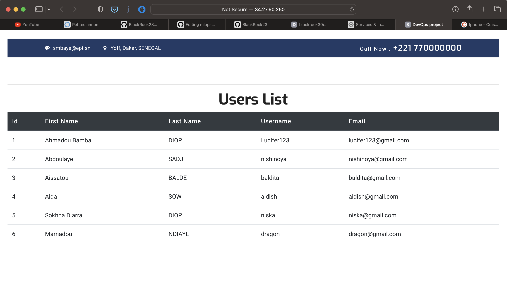
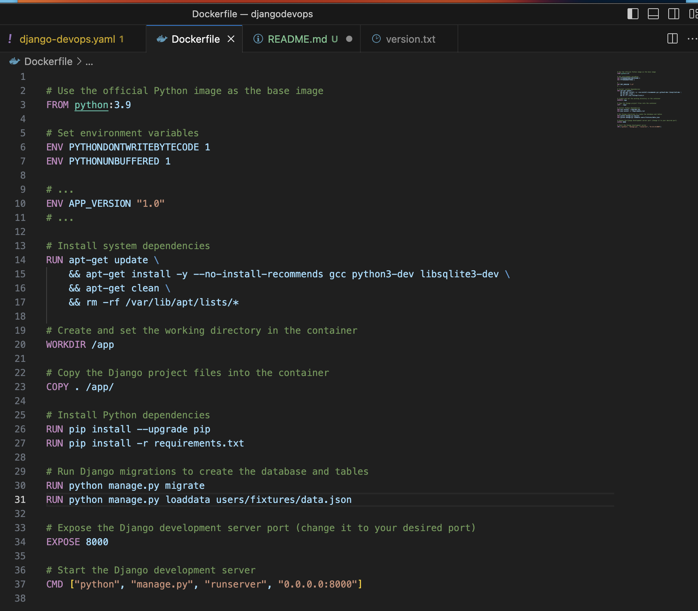
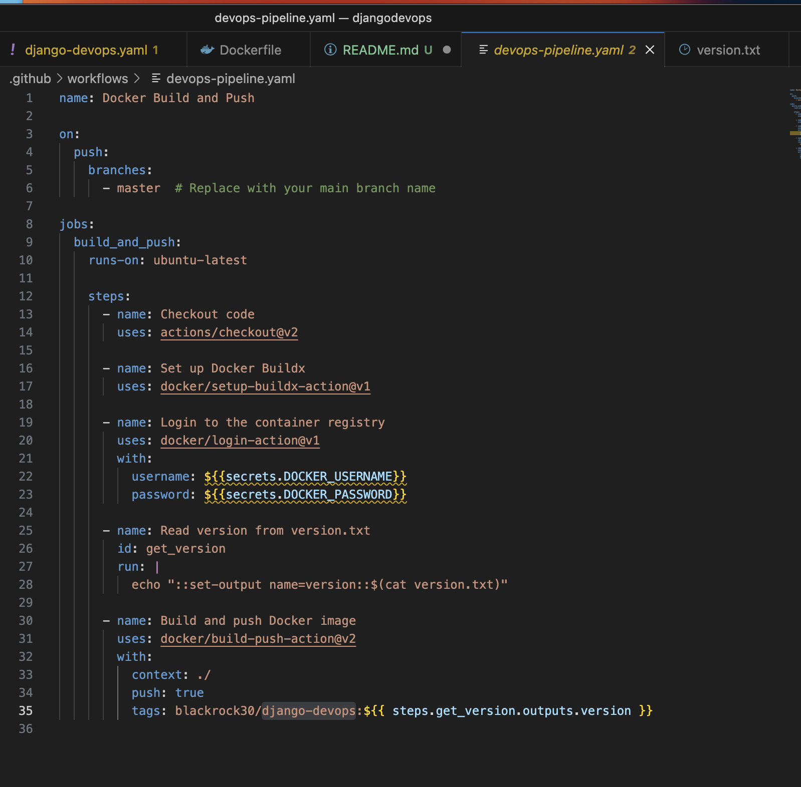
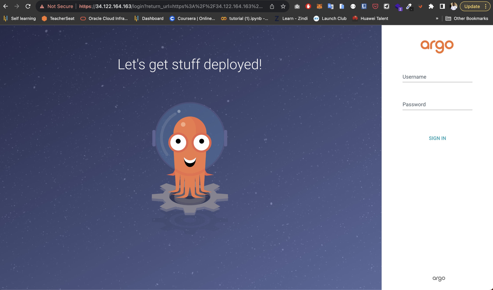
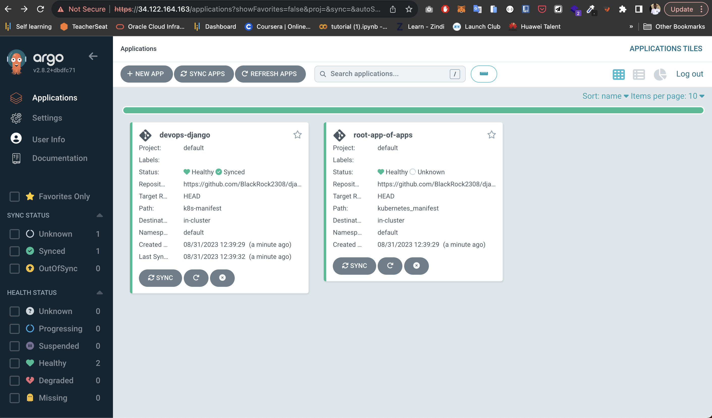
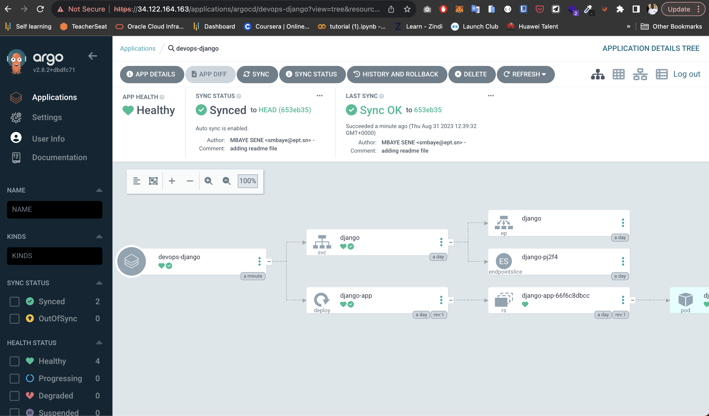
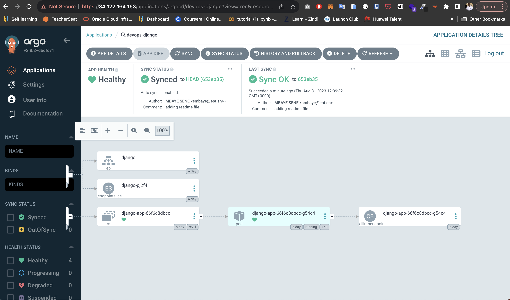

# DevOps Project with Django, Docker, GitHub Actions, and Kubernetes 

## Objective

Develop a simple Django application that is deployed using a Continuous Integration/Continuous Deployment (CI/CD) pipeline. The pipeline will be implemented using GitHub Actions, Docker, and Kubernetes.


## Members of the Group

- KADIA BASSOUM
- Madjiguene FAYE
- Omar Sahaba NDIAYE
- Mbaye SENE


### Web Application Development:



<!-- <p align="center">
  
  
</p> -->


### Dockerization:



### CI/CD Pipeline Setup:

The CI CD pipeline is build using github actions. After finsishes, our docker image will be send in our DOcker Hub for future used.



### Beyong Continuous Delivery, Continious Deployment with ArgoCD , GitOps tool

We have to know that CI/CD can have different meanings depending on the company. Most of company are just delivering a final executable using a continuous pipeline but more advanced company will deploy that final executable through the pipeline automatically for the end users without a human intervnation at all.
We can achieve that level of expertise by using a GitOps tool called ArgoCD that used git as the only source of truth for maitaining the right state of our K8s cluster.

Here is the login page of argoCD



- first of all, we used the app-of-apps patern for argoCD deployment because our k8s manifest is in the root directory of our django project. You can learn more about app-of-apps patern by clicking: [here](https://medium.com/dzerolabs/turbocharge-argocd-with-app-of-apps-pattern-and-kustomized-helm-ea4993190e7c)



All is done, we can see our ressources directly in our argocd UI. With this method, we no longer need to access to our cluster. All we have to do is the change our kubernetes manifest and push the code to git. ArgoCD will handle all the underlying process to get our application' new version up and running for end user.



Here we can see all the necessary ressources used in our kubernetes cluster.



### Kubernetes Deployment:

FOr our Kubernetes deployment, we created a cluster on Google Kubernetes Engine (GKE) with an autopilot mode. We all have to do there is to apply the manifest using kubectl command. You can notice that we created a service type LoadBalancer to access our application. By doing that, Google will create a external IP adress and expose our application for a public access.


## Link of the application
``` http://34.27.60.250:8000 ```

