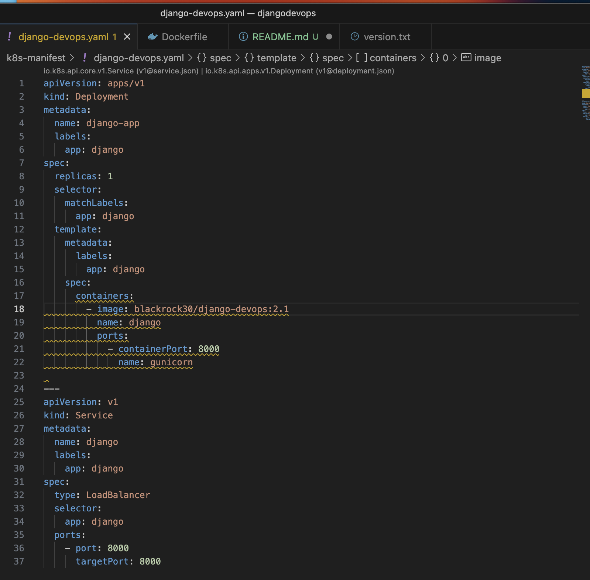

# DevOps Project with Django, Docker, GitHub Actions, and Kubernetes 

## Objective

Develop a simple Django application that is deployed using a Continuous Integration/Continuous Deployment (CI/CD) pipeline. The pipeline will be implemented using GitHub Actions, Docker, and Kubernetes.


## Members of the Group

- KADIA BASSOUM
- Madjiguene FAYE
- Omar Sahaba NDIAYE
- Mbaye SENE


### Web Application Development:


<!-- <p align="center">
  
  
</p> -->


### Dockerization:


### CI/CD Pipeline Setup:

The CI CD pipeline is build using github actions. After finsishes, our docker image will be send in our DOcker Hub for future used.


### Kubernetes Deployment:

FOr our Kubernetes deployment, we created a cluster on Google Kubernetes Engine (GKE) with an autopilot mode. We all have to do there is to apply the manifest using kubectl command. You can notice that we created a service type LoadBalancer to access our application. By doing that, Google will create a external IP adress and expose our application for a public access.




## Link of the application
``` http://34.27.60.250:8000 ```

